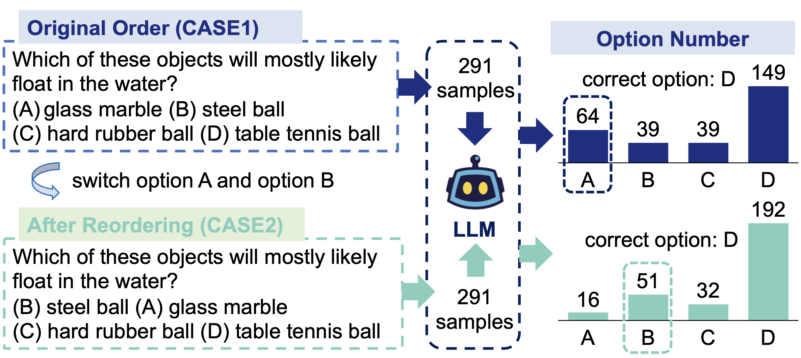
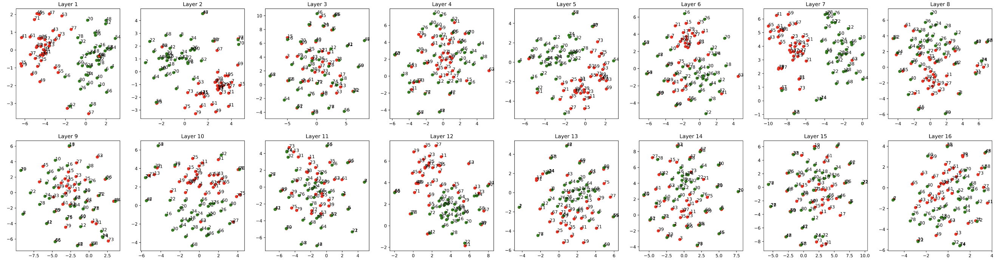

# Can multiple-choice questions really be useful in detecting the abilities of LLMs?

<table align="center" style="border: 1px solid white;">
  <tr>
    <td style="border: 1px solid white;"></td>
    <td style="border: 1px solid white;"></td>
  </tr>
</table>

Multiple-choice questions (MCQs) are commonly used to evaluate the knowledge and abilities of large language models (LLMs) because of their simple format and efficient inference process. However, there are concerns about **whether MCQs can truly assess the true capabilities of LLMs**. This is particularly relevant because LLMs are often used in knowledge-intensive scenarios where they are expected to generate long-form content. Using MCQs for evaluation can introduce a misalignment between what is being tested and what is actually required in these scenarios. We do some researches on [Are LLMs sensitive to the order of candidate answers?](#are-llms-sensitive-to-the-order-of-candidate-answers) and [Multiple Choice Questions vs Long Form Generation Questions](#multiple-choice-questions-vs-long-form-generation-questions), resulting in some interesting things. 

**Authors**:

<div style="overflow: hidden;">
  <ul>
    <li>Wangyue Li  (<a href="mailto:alee90792@gmail.com">alee90792@gmail.com</a>)
    <li>Liangzhi Li (<a href="mailto:liliangzhi@xiaoyouzi.com">liliangzhi@xiaoyouzi.com</a>)<sup>*</sup>
    <li>Tong Xiang  (<a href="mailto:xiangtong@xiaoyouzi.com">xiangtong@xiaoyouzi.com</a>)
    <li>Xiao Liu (<a href="mailto:liuxiao@xiaoyouzi.com">liuxiao@xiaoyouzi.com</a>)
    <li>Wei Deng (<a href="mailto:dengwei@swufe.edu.cn">dengwei@swufe.edu.cn</a>)
    <li>Noa Garcia  (<a href="mailto:noagarcia@ids.osaka-u.ac.jp">noagarcia@ids.osaka-u.ac.jp</a>)
  </ul>
</div>

<sup>*</sup>Corresponding author.

## Table of Contents
1. [Overview](#overview)
2. [Datasets and Models](#datasets-and-models)
3. [Are LLMs sensitive to the order of candidate answers?](#are-llms-sensitive-to-the-order-of-candidate-answers)
4. [Multiple Choice Questions vs Long Form Generation Questions](#multiple-choice-questions-vs-long-form-generation-questions)
5. [Citation](#citation)

## Overview

We start by demonstrating that LLMs exhibit a order sensitivity in bilingual MCQs, the **Chi-square test** of order sensitivity indicates that the order of options is a significant factor that influences the choices made by the LLMs. To quantify the gap between MCQs and long-form generation questions (LFGQs), we conduct experiments comparing their [direct outputs](#direct-output), [token logits](#token-logits), and [embeddings](#embeddings). We propose two methods that can quantify the **consistency** and **confidence** of LLMs’ output which can be generalized to other QA evaluation benchmarks. Moreover, we compare MCQs with LFGQs and True/False questions (TFQs) in term of **expected calibration error**. Our analysis also wonder that whether the misalignment between answering MCQs and LFGQs is not only reflected in their evaluation performance, but also manifested in embedding space.

## Datasets and Models
To investigate the preferences of LLMs to the order of options and the differences between MCQs and LFGQs, we conduct experiments on six evaluation benchmarks.
The evaluation benchmarks that we use are listed below:

| **Source**                                                                                   | **Language**   | **Size**      |
|----------------------------------------------------------------------------------------------|----------------|--------------:|
|[CARE-MI](https://github.com/Meetyou-AI-Lab/CARE-MI)   | ZH           |            1612 |
|[MLEC-QA](https://github.com/Judenpech/MLEC-QA)                                      | ZH            |            136236 |
|[MEDQA](https://arxiv.org/abs/2009.13081)                                                                                           | ZH/EN             |            61,097 |
|[M3KE](https://github.com/tjunlp-lab/M3KE)                 | ZH             |           20477  |
|[ARC](https://arxiv.org/abs/1803.05457)                 | EN             |           7,787 |
|[MATH]                                                | EN           |           300 |

The samples of the dataset CARE-MI and MATH we use can be found in `Datasets`.

We target decoder-only models since this architecture has become the dominant choices for recent LLMs. We utilize various models for conducting different experiments, tailoring our choices based on the specific goals of each experiment. The application of the LLMs for each experiment is summarized in the following table:

|  **Model** | **Order Sensitivity** | **Patterns Decomposition** | **Direct Output** | **Token Logits** | **Embeddings** |
|------------|-----------------------|----------------------------|-------------------|------------------|---------------:|
| [GPT-3.5-turbo](https://openai.com/blog/introducing-chatgpt-and-whisper-apis) | :heavy_check_mark:  | :heavy_check_mark: | :heavy_check_mark: |:heavy_check_mark:| |
| [GPT-4](https://doi.org/10.48550/arXiv.2303.08774) |:heavy_check_mark:|:heavy_check_mark: | :heavy_check_mark: |  |   |  
| [ChatGLM-6B](https://github.com/THUDM/ChatGLM-6B) | :heavy_check_mark: | :heavy_check_mark:| :heavy_check_mark: | | |
| [Stablelm-tuned-α-3/7B](https://replicate.com/stability-ai/stablelm-tuned-alpha-7b)  |  |  |  | | :heavy_check_mark:| 
| [RedPajama-INCITE-3B-v1](https://huggingface.co/togethercomputer/RedPajama-INCITE-Instruct-3B-v1)  |   |   |  | | :heavy_check_mark:| 
| [Dolly-v2-2/7/12B](https://www.databricks.com/blog/2023/04/12/dolly-first-open-commercially-viable-instruction-tuned-llm)  |   |   |  | |:heavy_check_mark: |  
| [Vicuna-7b-v1.3](https://codescrum.medium.com/vicuna-an-impressive-open-source-chatbot-matching-gpt-4-with-90-chatgpt-quality-41bbb22668bf) |   |   |  | |:heavy_check_mark: |  
| [Open-llama-3/7B](https://doi.org/10.48550/arXiv.2302.13971) |   |   |  | | :heavy_check_mark:|  
| [Llama-2-7b-chat-hf](https://arxiv.org/abs/2307.09288) |   |   |  | | :heavy_check_mark:| 

The paper is currently on [arXiv](https://arxiv.org/abs/XXXXX). [To do]

## Are LLMs sensitive to the order of candidate answers
We first find that when the LLMs are presented with some options in different orders, they consistently show a strong preference for the same position, as illustrated in the following figure. We have two cases of option order, in CASE1, the option numbering is ’ABCD’, and in CASE2, theo ption numbering is ’BACD’. The ground truth is always D. The LLM prefers wrong options in the first position in the ARC dataset.
<figure style="text-align: center;">
  
</figure>

To determine if there are significant differences in the options chosen by the LLMs in these two cases, we conduct a Chi-Square test [(McHugh, 2013)](https://www.biochemia-medica.com/en/journal/23/2/10.11613/BM.2013.018) for significance testing, the dataset of the results and code can be found in `Chi-Square test`. The following table present the results of the rearrangement of options makes LLMs output different answers:

| Sou. | Met. | GPT3.5 | GPT4 | ChatGLM |
| ---  | ---  | ---    | ---  | ---     |
| <div align="center">CARE-MI</div>| $X^2$ | 144.192 | 15.660 | 27.605 |
|        | $P$   | 0.000** | 0.001* | 0.000** |
|        | Acc   | 0.203   | 0.637  | 0.378   |
|        | Gap   | (-0.043) | (-0.029) | (-0.116) |
| <div align="center">M3KE</div>| $X^2$ | 90.308 | 20.829 | 12.377 |
|       | $P$   | 0.000** | 0.000** | 0.006** |
|       | Acc   | 0.381   | 0.632   | 0.411   |
|       | Gap   | (-0.030) | (-0.017) | (+0.014) |
| <div align="center">ARC</div> | $X^2$ | 36.515 | 2.681 | 10.511 |
|     | $P$   | 0.000** | 0.443  | 0.015* |
|     | Acc   | 0.512   | 0.935  | 0.553  |
|     | Gap   | (+0.148) | (-0.031) | (-0.116) |
| <div align="center">MATH</div> | $X^2$ | 25.129 | 4.513 | 90.566 |
|      | $P$   | 0.000** | 0.211  | 0.000** |
|      | Acc   | 0.597   | 0.780  | 0.480  |
|      | Gap   | (+0.00) | (-0.023) | (-0.043) |

* $P<0.05$ ** $P<0.001$, $P$ in bold are larger than significance level $\alpha$. **Sou.** stands for the sources of the datasets, **Met.** represents the four metrics: $X^2$, $P$, accuracy and the accuracy gap.

From the table above, we know that the rearrangement of options makes LLMs choices differ in significance, resulting in instability of the accuracy evaluation. High accuracy can mitigate significant differencesn to some extent. Moreover, there is no evident correlation between the accuracy gap and the original accuracy.

<h2 id="4">Multiple Choice Questions vs Long Form Generation Questions</h2>

### Direct Output

It is crucial to establish a quantitative measure for both consistency and accuracy. Consistency stands for the degree to which the LLMs are consistent with the answer to the same question when asked multiple times, and accuracy represents the times of the LLMs answer correctly to the same question when asked multiple times. The code and test dataset of calculating the consistency and accuracy can be found in `Consistency`. 

### Token Logits

Next, we want to compare with MCQs and LFGQs in token probability, we follow [(Jiang et al., 2021)](https://direct.mit.edu/tacl/article/doi/10.1162/tacl_a_00407/107277/How-Can-We-Know-When-Language-Models-Know-On-the) in calculating normalized probability to propose an unified confidence calculation that is suitable for MCQs, LFGQs and TFQs. The code and test dataset of unified confidence calculation can be found in `Confidence`. The details of calculation formula can be read in the paper.


Once we get unified confidence of the LLMs, we can do the model calibration [(Ahmed et al., 2020)](https://link.springer.com/chapter/10.1007/978-981-15-4728-7_5) to test whether the LLM is a well-calibrated model when under different datasets formats of evaluation benchmarks. The code and test dataset of unified confidence calculation can be found in `ECE`. 


### Embeddings

Our analysis reveals that the misalignment between answering MCQs and LFGQs can be reflected in their [direct outputs](#direct-output) and [token logits](#token-logits), so we wonder if the difference between them is also manifested in embedding space. 

The code can be found in `Embeddings`.

To setup the environment for the codes in this repository, run:

```
git clone https://github.com/AshleyLeeB/Can-MC-Evaluate-
conda create -n test python=3.8.16
conda activate test
cd Embeddings
pip install -r requirements.txt
```
First, you can download the models you want:
```
sudo apt-get install git-lfs
git lfs install
cd scripts
sh download_models.sh 
```

Second, you get the activations of the model:
```
cd src
python get_activations.py
```
Then, we can visualize the features through t-Distributed stochastic neighbor embedding for dimensionality reduction. The following figure shows us the visualization of t-SNE for each layer in the  stablelm-tuned-alpha-3b, the red samples are MCQs, and the samples in green are LFGQs. Based on the analysis of figure, we can see in certain specific layers of the hidden state, the embeddings can be clearly separated.

<figure style="text-align: center;">
  
</figure>

## Citation

**If the paper, codes, or the dataset inspire you, please cite us:**

```
@article{XXX
  title={Can multiple-choice questions really be useful in detecting the abilities of LLMs?},
  author={XXX},
  journal={arXiv preprint arXiv:XXXX},
  year={2023}
}
```
